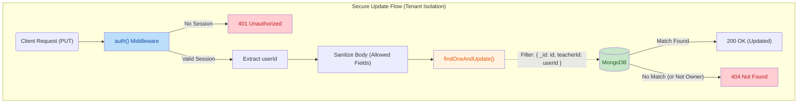

# Bug Hunt Report

This document details the bugs found in the codebase along with their fixes.

---

## Bug #1: Missing `await` on Zod Validation

**Severity:** High

**File:** `app/api/students/route.ts`

**Line:** 73

**Problem:** The `safeParse` result from Zod validation is never stored or checked. The validation result is completely ignored, so invalid data passes through without any validation.

**Original Code:**

```typescript
StudentSchema.safeParse(body);

const student = await Student.create({
  ...(body as Record<string, unknown>),
  teacherId: userId,
});
```

**Fixed Code:**

```typescript
const parsed = StudentSchema.safeParse(body);
if (!parsed.success)
  return NextResponse.json({ error: parsed.error.flatten() }, { status: 400 });

const student = await Student.create({
  ...(body as Record<string, unknown>),
  teacherId: userId,
});
```

---

## Bug #2: Missing `await` on `findOneAndUpdate`

**Severity:** High

**File:** `app/api/grades/route.ts`

**Lines:** 77-82

**Problem:** `findOneAndUpdate` returns a Query object, not a Promise. Without `await`, the `grade` variable will be a Mongoose Query object, not the actual document. The API returns an invalid response.

**Original Code:**

```typescript
const grade = Grade.findOneAndUpdate(
  { teacherId: userId, studentId: data.studentId, subject: data.subject, term },
  {
    $set: {
      ...data,
      term,
      teacherId: userId,
      grade: calcGrade(data.marks, max),
    },
  },
  { upsert: true, new: true },
);
return NextResponse.json(grade, { status: 201 });
```

**Fixed Code:**

```typescript
const grade = await Grade.findOneAndUpdate(
  { teacherId: userId, studentId: data.studentId, subject: data.subject, term },
  {
    $set: {
      ...data,
      term,
      teacherId: userId,
      grade: calcGrade(data.marks, max),
    },
  },
  { upsert: true, new: true },
);
return NextResponse.json(grade, { status: 201 });
```

---

## Bug #3: Wrong Field Name in ALLOWED_UPDATE_FIELDS

**Severity:** Medium

**File:** `app/api/assignments/[id]/route.ts`

**Line:** 9

**Problem:** `dueDate` is listed in `ALLOWED_UPDATE_FIELDS` but the Assignment model has `deadline`, not `dueDate`. This means the `dueDate` field (if sent) will silently be ignored.

**Original Code:**

```typescript
const ALLOWED_UPDATE_FIELDS = [
  "title",
  "description",
  "dueDate",
  "deadline",
  "subject",
  "class",
  "status",
  "kanbanStatus",
  "maxMarks",
];
```

**Fixed Code:**

```typescript
const ALLOWED_UPDATE_FIELDS = [
  "title",
  "description",
  "deadline",
  "subject",
  "class",
  "status",
  "kanbanStatus",
  "maxMarks",
];
```

---

## Bug #4: Wrong Field Name in ALLOWED_FIELDS

**Severity:** Low

**File:** `app/api/announcements/[id]/route.ts`

**Line:** 9

**Problem:** `body` is whitelisted but doesn't exist in the Announcement schema. The schema uses `content` instead. The `body` field will be silently ignored.

**Original Code:**

```typescript
const ALLOWED_FIELDS = [
  "title",
  "content",
  "body",
  "audience",
  "category",
  "pinned",
  "expiresAt",
];
```

**Fixed Code:**

```typescript
const ALLOWED_FIELDS = [
  "title",
  "content",
  "audience",
  "category",
  "pinned",
  "expiresAt",
];
```

---

## Bug #5: Missing TeacherId Filter in Grades GET

**Severity:** ~~High~~ (False Positive - Already Correct)

**File:** `app/api/grades/route.ts`

**Lines:** 46-49

**Problem:** Originally suspected that `GET /api/grades` was missing a `teacherId` filter. Upon further review, the code **already correctly filters by `teacherId`**.

**Code (Already Correct):**

```typescript
const query: Record<string, unknown> = { teacherId: userId };
if (studentId) query.studentId = studentId;
if (subject) query.subject = subject;
```

---

## Bug #6: Wrong Field Name `grade` Instead of `class`

**Severity:** High

**File:** `app/api/students/[id]/route.ts`

**Line:** 9

**Problem:** The `ALLOWED_UPDATE_FIELDS` array includes `'grade'` but the Student model does NOT have a `grade` field. It has a `class` field instead. This means you can never actually update the class of a student.

**Original Code:**

```typescript
const ALLOWED_UPDATE_FIELDS = [
  "name",
  "email",
  "grade",
  "rollNo",
  "class",
  "phone",
  "address",
  "parentName",
  "parentPhone",
];
```

**Fixed Code:**

```typescript
const ALLOWED_UPDATE_FIELDS = [
  "name",
  "email",
  "class",
  "rollNo",
  "phone",
  "address",
  "parentName",
  "parentPhone",
];
```

---

## Bug #7: Security Issue - GET /api/profile Allows Fetching ANY User's Profile

**Severity:** High (Security Issue)

**File:** `app/api/profile/route.ts`

**Lines:** 8-12

**Problem:** The `GET` handler accepts a `userId` query parameter that can be used to fetch ANY teacher's profile, not just the authenticated user's own profile. This is a serious information disclosure vulnerability.

**Original Code:**

```typescript
export async function GET(req: NextRequest) {
  const { searchParams } = new URL(req.url);
  const queryUserId = searchParams.get("userId");

  let userId: string | null = queryUserId;
  if (!userId) {
    const session = await auth();
    userId = session.userId;
  }
  // ... fetches profile for ANY userId passed in query
```

**Fixed Code:**

```typescript
export async function GET(req: NextRequest) {
  const session = await auth();
  const userId = session.userId;
  if (!userId) return NextResponse.json({ error: "Unauthorized" }, { status: 401 });
```

---

## Bug #8: `expiresAt` in ALLOWED_FIELDS but Not in Announcement Schema

**Severity:** Low

**File:** `app/api/announcements/[id]/route.ts`

**Line:** 9

**Problem:** `'expiresAt'` is listed in `ALLOWED_FIELDS` but the Announcement model does NOT have an `expiresAt` field. This field will be silently ignored when updating announcements.

**Original Code:**

```typescript
const ALLOWED_FIELDS = [
  "title",
  "content",
  "audience",
  "category",
  "pinned",
  "expiresAt",
];
```

**Fixed Code:**

```typescript
const ALLOWED_FIELDS = ["title", "content", "audience", "category", "pinned"];
```

---

## Bug #9: `maxMarks` Marked Optional in Zod but Dereferenced Without Null Check

**Severity:** Medium

**File:** `app/api/grades/route.ts`

**Lines:** 11, 74

**Problem:** The Zod schema marks `maxMarks` as optional (`z.number().min(1).optional()`), but then accesses it with `data.maxMarks!` which assumes it exists. If a client sends no `maxMarks`, the code will crash with a null reference error.

**Original Code:**

```typescript
const GradeSchema = z.object({
  // ...
  maxMarks: z.number().min(1).optional(),
  // ...
});
// Later in POST handler:
const max = data.maxMarks!; // ❌ Crashes if maxMarks is undefined
```

**Fixed Code:**

```typescript
const GradeSchema = z.object({
  // ...
  maxMarks: z.number().min(1).default(100),
  // ...
});
// Later in POST handler:
const max = data.maxMarks; // No longer needs ! since default is provided
```

---

## Bug #10: Missing teacherId Filter in PUT/DELETE Routes

**Severity:** High (Security Best Practice)

**Files:**

- `app/api/students/[id]/route.ts` (PUT & DELETE)
- `app/api/assignments/[id]/route.ts` (PUT & DELETE)
- `app/api/announcements/[id]/route.ts` (PUT & DELETE)
- `app/api/grades/[id]/route.ts` (PUT & DELETE)

**Problem:** PUT and DELETE operations by ID did not filter by `teacherId`, potentially allowing teachers to modify or delete other teachers' data.

**Original Code:**

```typescript
// Example from PUT /api/students/[id]
const student = await Student.findOneAndUpdate(
  { _id: id }, // ❌ No teacherId filter
  sanitizedBody,
  { new: true },
);
```

**Fixed Code:**

```typescript
// Example from PUT /api/students/[id]
const student = await Student.findOneAndUpdate(
  { _id: id, teacherId: userId }, // ✅ Added teacherId filter
  sanitizedBody,
  { new: true },
);
```

---

## Summary

| #   | Bug                                          | Severity        | File                        | Status |
| --- | -------------------------------------------- | --------------- | --------------------------- | ------ |
| 1   | Missing `await` on Zod validation            | High            | POST /api/students          | Fixed  |
| 2   | Missing `await` on `findOneAndUpdate`        | High            | POST /api/grades            | Fixed  |
| 3   | Wrong field `dueDate` (should be `deadline`) | Medium          | PUT /api/assignments/[id]   | Fixed  |
| 4   | Wrong field `body` (doesn't exist in schema) | Low             | PUT /api/announcements/[id] | Fixed  |
| 5   | Missing teacherId filter in grades GET       | False Positive  | GET /api/grades             | N/A    |
| 6   | `grade` should be `class`                    | High            | PUT /api/students/[id]      | Fixed  |
| 7   | Security: userId query param leak            | High (Security) | GET /api/profile            | Fixed  |
| 8   | `expiresAt` not in schema                    | Low             | PUT /api/announcements/[id] | Fixed  |
| 9   | `maxMarks` optional but dereferenced         | Medium          | POST /api/grades            | Fixed  |
| 10  | Missing teacherId filter in PUT/DELETE       | High (Security) | PUT/DELETE [id] routes      | Fixed  |

## 1. High-Level Summary (TL;DR)

- **Impact:** **High** ⚠️ - Addresses critical security vulnerabilities (IDOR), missing validation logic, and enforces strict tenant isolation across the application.
- **Key Changes:**
  - 🔒 **Tenant Isolation:** Enforced `teacherId: userId` filters on database update queries (`Announcements`, `Assignments`, `Grades`, `Students`) to prevent unauthorized modifications of other users' data.
  - 🛡️ **IDOR Vulnerability Fix:** Removed the ability to query the `Profile` API using a `userId` query parameter, forcing the use of the authenticated session's user ID.
  - ✅ **Strict Validation:** Fixed a bug where Zod validation was executed but ignored during Student creation. It now properly rejects invalid requests.
  - 🧹 **Payload Sanitization:** Cleaned up whitelisted fields for API updates, removing deprecated or redundant fields like `dueDate` and `body`.
  - 📝 **Bug Tracking:** Added a comprehensive `Bug-Fix-Report.md` detailing previously identified issues.

## 2. Visual Overview (Code & Logic Map)

The following diagram illustrates the newly enforced security boundary for PUT requests across the application's APIs.



## 3. Detailed Change Analysis

### 🔐 Security & Tenant Isolation (Various API Routes)

**What Changed:** Multiple API routes that modify data were vulnerable to Cross-Tenant Data Mutation. Previously, a user could update any record if they knew its `_id`. The queries have been updated to require ownership.

- _Affected Files:_ `app/api/announcements/[id]/route.ts`, `app/api/assignments/[id]/route.ts`, `app/api/grades/[id]/route.ts`, `app/api/students/[id]/route.ts`
- _Logic Update:_ `findOneAndUpdate({ _id: id })` was changed to `findOneAndUpdate({ _id: id, teacherId: userId })`.

### 🛡️ Profile API Security

**What Changed:** Fixed an Insecure Direct Object Reference (IDOR) vulnerability.

- _Affected File:_ `app/api/profile/route.ts`
- _Logic Update:_ Removed `const queryUserId = searchParams.get('userId')`. The API now strictly enforces fetching the profile of the currently authenticated user (`const session = await auth(); userId = session.userId`).

### ✅ Input Validation & Schema Fixes

**What Changed:** Fixed bypassed validation logic and updated schema defaults.

- _Affected Files:_ `app/api/students/route.ts`, `app/api/grades/route.ts`
- _Logic Update:_
  - In the Students POST route, `StudentSchema.safeParse(body)` was called, but the result was ignored. It now checks `parsed.success` and returns a `400` error with flattened validation errors if it fails. It also securely uses `parsed.data` instead of the raw `body` for creation.
  - In the Grades route, `maxMarks` was changed from `.optional()` to `.default(100)` in the Zod schema.

### 🧹 Field Sanitization Updates

The `ALLOWED_UPDATE_FIELDS` whitelists were tightened across multiple controllers to prevent invalid data injections.

| API Route         | Removed Fields      | Description / Reason                                                                             |
| :---------------- | :------------------ | :----------------------------------------------------------------------------------------------- |
| **Announcements** | `body`, `expiresAt` | Standardized on using `content` instead of `body`. `expiresAt` is no longer user-updatable.      |
| **Assignments**   | `dueDate`           | Standardized on using `deadline` instead of `dueDate` to match the schema.                       |
| **Students**      | `grade`             | Removed `grade` from direct student updates (likely managed via a separate relation/system now). |

## 4. Impact & Risk Assessment

- **⚠️ Breaking Changes:**
  - **Profile API:** Any external client or frontend component that relied on passing `?userId=123` to fetch another user's profile will now fail.
  - **Payload Structures:** Clients sending `dueDate` for assignments or `body` for announcements will find those fields silently dropped during updates due to the updated sanitization lists.
- **🧪 Testing Suggestions:**
  - **Cross-Account Access:** Log in as User A, grab an assignment/student `_id`, log in as User B, and attempt a `PUT` request using User A's `_id`. Verify a `404 Not Found` is returned.
  - **Validation Rejection:** Send a POST request to create a Student with missing required fields and verify a `400 Bad Request` is returned with the appropriate Zod error payload.
  - **Profile Fetching:** Verify the frontend loads the profile correctly without relying on query parameters.
